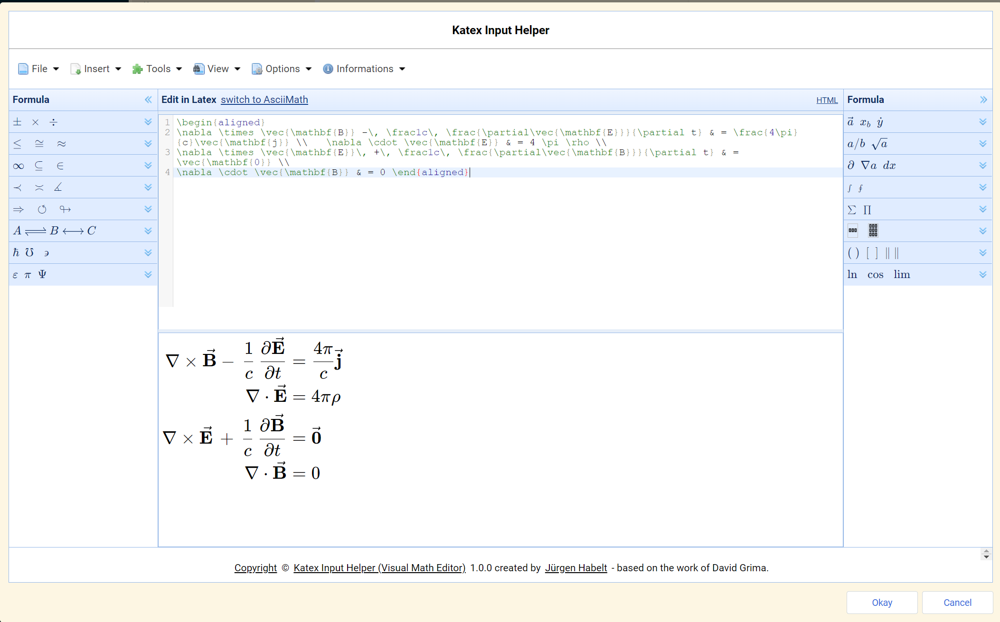
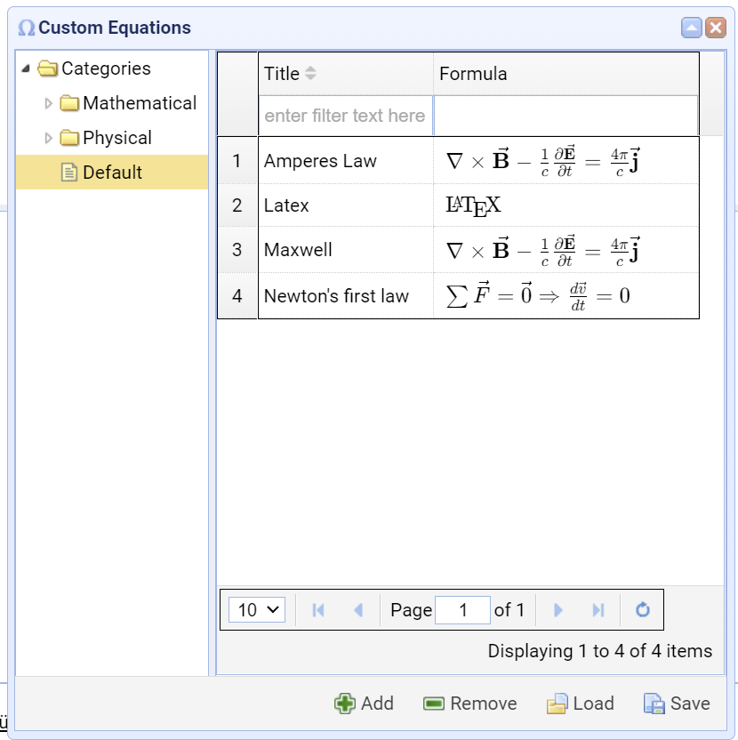

# Katex Input Helper Joplin Plugin

This plugin can be used to support the input of Mathematical formulae. It does this by opening an input dialog by command, then generating the formula and finally returning the edited formula back to the original note.

## Basic Instructions

1. Open a note with a formula area, select a piece of the formula to be processed.
2. Invoke the Katex Input Helper dialog with a keyboard shortcut.
3. Process the formula in the upper part of the dialog in Katex format.
4. Get feedback in the lower part of the dialog where the generated formula is displayed.
5. Finally leave the dialog either by pressing the **Okay** or the **Cancel** button.
6. By pressing Okay the changed content is returned to the note and replaces the original selection.
7. By pressing Cancel nothing is changed.

## Step - by - Step Instructions

1. Enter the *Katex Input Helper* with a certain selection of a formula. With no selection in the current note the editor will be opened empty.
1. Insertion of formulae from the palette window(s)
   1. Open the palette with the desired template, f.i. an integral
   2. Click the template to insert it into the editor window
   3. Fill in the missing pieces of the formula
   4. This filling can be recursive, e.g. require another click on a different template
   5. The same can be done with the usage of other auxiliary windows, f.i. horizontal or vertical spacing, matrices or sample equations
   6. Many of them don't use placeholders as the "templates" often do
5. Returning a processed formula
   1. Simply leave the dialog with *Okay* and the content of the editor area will be returned back to the Joplin note and replaces the original selection.
   2. Pressing *Cancel* leaves the original note as it was before invocation of the dialog
3. Loading and saving the editor area
   This can be done by invoking the menu commands *File - Open* or *File - Save* respectively
4. Working with the *Custom Equations* dialog.
   One can invoke this dialog by clicking *Insert - Custom Equations*.
   It is possible to perform the following tasks:
   1. Save the set of formulae into a json file
   2. Load a set of formulae from a json file
   3. Add a formula from the editor area
   4. Remove checked formulae from the datagrid
   5. Click a formula to insert it into the editor area
   6. Edit the *Title* field of a formula by double - clicking it
   7. Filter the set of formulae by a filter expression. Actually this checks if the filter expression is contained in the title field
   8. Sort the formulae by title
   9. Select pages of a huge formula set
   10. Edit the new *Categories* tree on the left side. Categories are divided into folders and leafs. Only the leafs can contain formulae.
   11. By selecting a Leaf one can select the formulae contained in it.
   12. One can sort existing formulae into different Leafs.
   13. The old style formula collection is not lost. Such formulae are sorted into a *Default* leaf node.
1. Retaining window positions and sizes.
   By default the window positions and sizes are retained leaving them intact through invocations of the window itself or the whole Katex Input Helper.
   This feature can be deactivated by deselecting the appropriate checkbox in the Settings dialog (Menu command *Options - Editor Parameters...*).
   These *Hidden settings* can be reset on behalf of the *Settings* dialog.

## Origin of the Software

The plugin is based on the *Visual Math Editor* by David Grima, a freeware which can be changed and distributed freely. I made the following changes to this software:

1. Reverse engineering
2. Updated the included software libraries to current ones.
3. Replaced the MathJax package by a Katex package.
4. Removed some components of the software not needed for this purpose, like:
   1. AsciiMath support
   2. Translation of the Katex expression into MathML
   3. A HTML mode to support html input
   4. Some dialogs and menu items
   5. Some MathJax expressions are not supported in Katex and removed for this reason
5. But most components are left as is and the external appearance is preserved

As You can see, this software is feature rich and alleviates the creation of formulae. My hope is one will get further support by the integration into *Joplin* as a plugin.

This software is available on the net [here](https://visualmatheditor.equatheque.net/VisualMathEditor.html?runLocal&codeType=Latex&encloseAllFormula=false&style=aguas&localType=en_US) and You can view at it to get an impression.

## Features

1. Editing in a text editor like the one in Joplin
2. Feedback in the formula output area
3. 16 palettes with formula templates like Sum and Product, Integral and much more
4. Formula dialogs with samples with can be incorporated easily or studied for learning the Katex language
5. A **custom equations** dialog which can be used to maintain one's own formula library and with the possibility to Add, Remove, Load, Save the formula set. This set is persisted through invocations of Joplin as hidden setting.
6. Window positions and sizes are persisted

## Some Screenshots

The main dialog window

The custom equations dialog

The custom equations dialog with categories tree

## Known Problems

- A minor problem is a missing update of the language of the data grid paging bar in the *Custom Equations* dialog. This only appears during language change during an actual activation of the dialog.
- The persistence of custom equations can be damaged when a filter is active. 

## Release Notes

### 2.1.1

- Removed function-less code.
- Minor bug fixes.
- Added unit tests (still under development).
- MathJax list replaced by a supported Katex functions link.

### 2.1.0

**New features**

- The plug-in was migrated to typescript as programming language.
- A dependency injection framework was introduced.
- The handling of the information window was improved.
- The web version of this app now supports a mobile parameter in the query string. But this is 
  merely an experimental feature in an early stage.
- Extensive re-factorings of the source code to improve the code structure.

### 2.0.1

**New features**

- The language switcher is now equipped with country flags.
- The functionality of this plug-in is now also available as [Web app](https://mick2nd.github.io/Katex-Input-Helper/index.html) 
hosted on Github. This can be used as Demo or to have a look at pre-published versions. 
It's also running on mobile devices.
- The browser version is equipped with cookies to support persistence of settings.
- Made the production version working hereby reducing the size of the plug-in.
- The browser version (see above) is also adapted for mobile devices.

**Bug fixes**

- The context menus crashed on the trial to invoke and click them. A workaround helps here.
This fact is completely invisible to the user.
- The "Reset Windows Positions" functionality was broken, which is fixed now.

### 2.0.0

- Fixed the start problem, e.g. the known problems [document](./KNOWN-PROBLEMS.md) is no longer valid.
- The functionality is more or less the same.
- Fixed all problems detected during the adjustment to usage of Webpack as a bundler.
- After the adjustment I had no single start failure.

### 1.0.10

- Fixed a lot of warnings in HTML.
- Bug fix: 2 of the diagrams in CD dialog did not render properly.
- Bug fix: a tool tip in the CD dialog did not show up properly.
- Improvement: the tool tip handling was unified, all tool tips use *Themes* now.

### 1.0.9

- Bug fix: A bug caused a circular reference during JSON conversion.
- Bug fix: A bug caused crash during closure of the dialog.
- Improvement on start handling.
- Update Katex to version 0.16.22

### 1.0.8

- For the last selected node in the tree of the *Custom Equations* dialog the path is stored to reproduce this node over invocations.
- Some buttons (links) are equipped with tool tips and click handlers to enable for instance the invocation of the *issues* page in the Internet.

### 1.0.7

- Bug fix: *Custom Equations* dialog did not work properly.
- The invocation context (e.g. if invoked from display mode or not) is now used in the Katex Input Helper.

### 1.0.6

- The *Custom Equations* dialog is now equipped with a categories tree and with tooltips to get usage hints.
- All dialog windows are now resizable, the *Parameters* dialog is now equipped with a *Reset Window Positions* button.
- The *Unicode* dialog was improved. The codes now correctly are displayed in the *Katex* editor and the app will no longer crash, if a code section is selected on the left side.
- The documentation commands did no longer work. This is fixed now and documentation from external sources is displayed in a Browser window.
- The localization was completed including the Copyright line.
- The *Informations* dialog was completed with some new version information.
- The equations of the *Custom Equations* dialog were not fully persisted but shrinked to the current page instead. This is fixed now.

### 1.0.5

- Bug fix: *Custom Equations* dialog removal problem.

### 1.0.4

Fixed the following problems:

- The *Custom Equations* dialog did not persist the equations added to data grid nor did it persist removed equations.

### 1.0.3

Fixed the following problems:

- *Custom Equations* dialog inserted formula twice on click.
- Certain insertions did select the insertion afterwards. This is fixed now and enables easy successive insertions.
- The sort functionality of the *Custom Equations* dialog did not work properly. One can click on the *Title* head to sort formulae.
- Some dialog windows were modal ones instead of non-modal. This prevented the selection of text in the editor during display of the dialog.
- The restore of window size and position was not reliable.

### 1.0.2

In the last release a few bugs have sneaked in. Those have been fixed now:

- Info dialog did not show the content of 3 tabs
- The resources dialog did not show completely
- The Title field in the *Custom Equations* dialog was no longer editable

### 1.0.1

Bug fixes and improvements

- Some localizations in Custom Equations dialog have been improved
- Persistence concept was improved
- Added filtering to the Custom Equations dialog
- Architectural changes

### 1.0.0

Initial release
